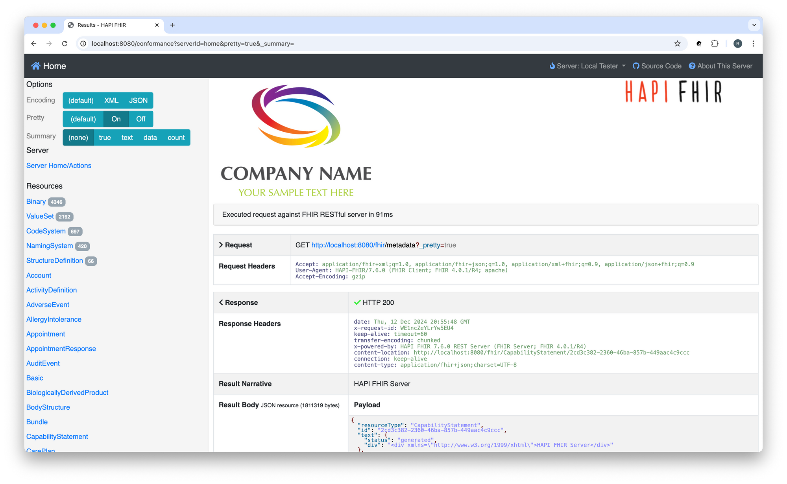

## ❯ Quick Start Guide

### Clone the project

Change the current working directory to the location where you want the cloned project to be:

```
cd ~/workspace
```

Clone the project by running the following command:

```
git clone git@github.com:Robinyo/hapi-fhir-jpaserver-starter.git
cd ~/workspace/hapi-fhir-jpaserver-starter
``` 

## ❯ Development

Remember to adjust the Web Testpage Overlay configuration in the project's [application.yaml](https://github.com/Robinyo/hapi-fhir-jpaserver-starter/blob/master/src/main/resources/application.yaml)

For example:

```

    ...

    tester:
      home:
        name: Local Tester
        server_address: 'http://localhost:8080/fhir'
        refuse_to_fetch_third_party_urls: false
        fhir_version: R4
```

To build HAPI FHIR:

```
mvn clean install

# or

mvn clean install -DskipTests=true
```

### Docker Compose

To build the project:

```
docker system prune && \
docker container prune && docker volume prune && docker network prune

docker compose -f docker-compose-fhir-au.yml build
```

#### Run

With a single command, you can create and start all the services:

```
docker compose -f docker-compose-fhir-au.yml up
```

Navigate to the **Welcome** page: 

```
http://localhost:8080
```

You should see something like:

<p align="center">
  
</p>

And in the logs:

```

...

hapi-fhir  | 2025-10-14T21:16:02.328Z  INFO 1 --- [           main] ca.uhn.fhir.jpa.starter.Application      : Started Application in 27.688 seconds (process running for 28.332)
hapi-fhir  | 2025-10-14T21:16:43.120Z  INFO 1 --- [nio-8080-exec-1] o.a.c.c.C.[Tomcat].[localhost].[/]       : Initializing Spring DispatcherServlet 'dispatcherServlet'
hapi-fhir  | 2025-10-14T21:16:43.120Z  INFO 1 --- [nio-8080-exec-1] o.s.web.servlet.DispatcherServlet        : Initializing Servlet 'dispatcherServlet'
hapi-fhir  | 2025-10-14T21:16:43.128Z  INFO 1 --- [nio-8080-exec-1] o.s.web.servlet.DispatcherServlet        : Completed initialization in 7 ms
hapi-fhir  | 2025-10-14T21:16:43.238Z  INFO 1 --- [nio-8080-exec-1] ca.uhn.fhir.context.FhirContext          : Creating new FHIR context for FHIR version [R4]
hapi-fhir  | 2025-10-14T21:16:44.039Z  INFO 1 --- [nio-8080-exec-2] c.u.f.log.terminology_troubleshooting    : Performing initial retrieval for non-expiring cache: org.hl7.fhir.common.hapi.validation.support.ValidationSupportChain$FetchAllKey@4d61a2b
hapi-fhir  | 2025-10-14T21:16:44.091Z  INFO 1 --- [nio-8080-exec-2] c.u.f.log.terminology_troubleshooting    : Initial retrieval for non-expiring cache org.hl7.fhir.common.hapi.validation.support.ValidationSupportChain$FetchAllKey@4d61a2b succeeded in 52ms
hapi-fhir  | 2025-10-14T21:16:44.913Z  INFO 1 --- [nio-8080-exec-2] fhirtest.access                          : Path[/fhir] Source[] Operation[metadata  ] UA[HAPI-FHIR/8.4.0 (FHIR Client; FHIR 4.0.1/R4; apache)] Params[] ResponseEncoding[JSON] Operation[metadata  ] UA[HAPI-FHIR/8.4.0 (FHIR Client; FHIR 4.0.1/R4; apache)] Params[] ResponseEncoding[JSON]
hapi-fhir  | 2025-10-14T21:16:45.348Z  INFO 1 --- [nio-8080-exec-1] ca.uhn.fhir.context.FhirContext          : Creating new FHIR context for FHIR version [R4]
hapi-fhir  | 2025-10-14T21:16:47.928Z  WARN 1 --- [nio-8080-exec-4] o.s.web.servlet.PageNotFound             : No mapping for GET /content/custom/logo.jpg
hapi-fhir  | 2025-10-14T21:16:47.928Z  WARN 1 --- [nio-8080-exec-3] o.s.web.servlet.PageNotFound             : No mapping for HEAD /content/custom/welcome.html
hapi-fhir  | 2025-10-14T21:16:47.961Z  WARN 1 --- [nio-8080-exec-3] o.s.web.servlet.PageNotFound             : No endpoint HEAD /content/custom/welcome.html.
hapi-fhir  | 2025-10-14T21:16:47.961Z  WARN 1 --- [nio-8080-exec-4] o.s.web.servlet.PageNotFound             : No endpoint GET /content/custom/logo.jpg.
```

To stop the services:

```
docker compose -f docker-compose-fhir-au.yml stop
```

To remove the services:

```
docker compose -f docker-compose-fhir-au.yml down
```

To remove the data volume:

```
docker volume rm hapi-fhir-jpaserver-starter_postgres_data
```

To restart the services:

```
docker compose -f docker-compose-fhir-au.yml up
```

